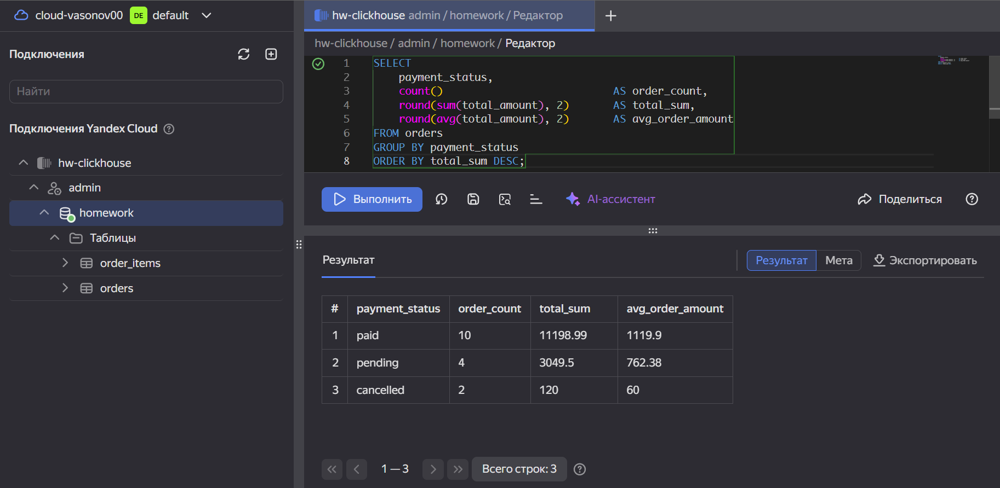
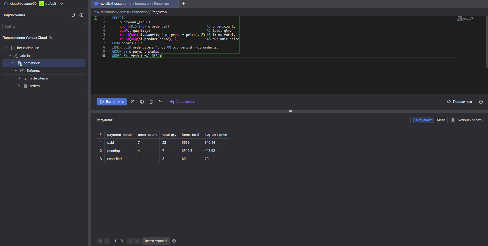
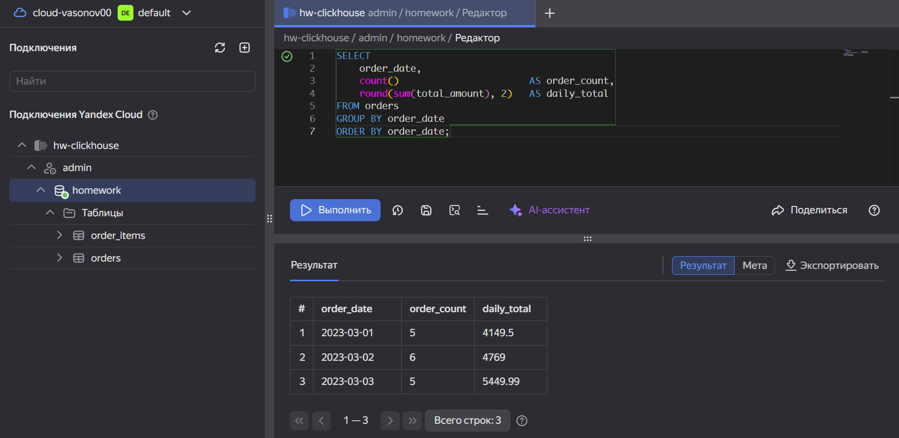
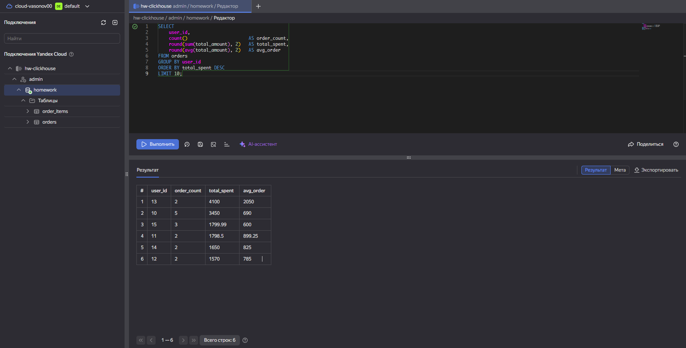
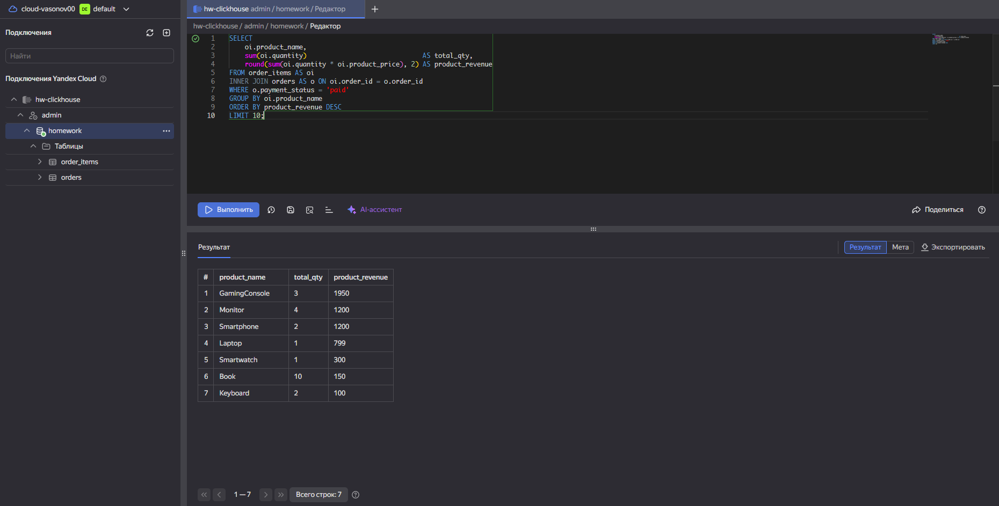
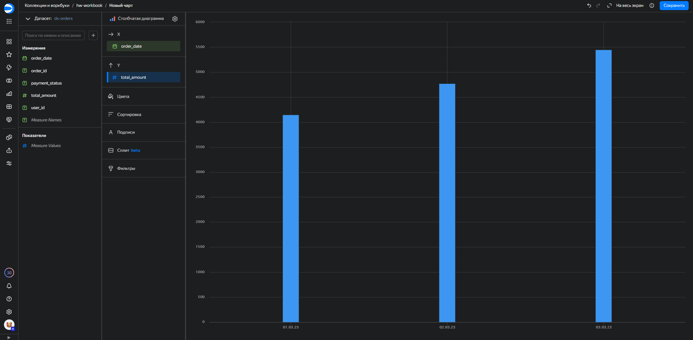
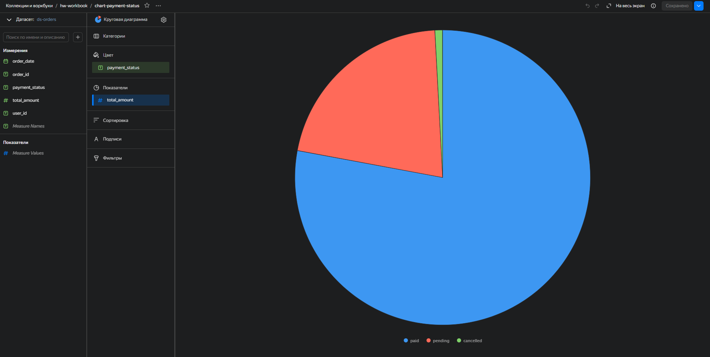
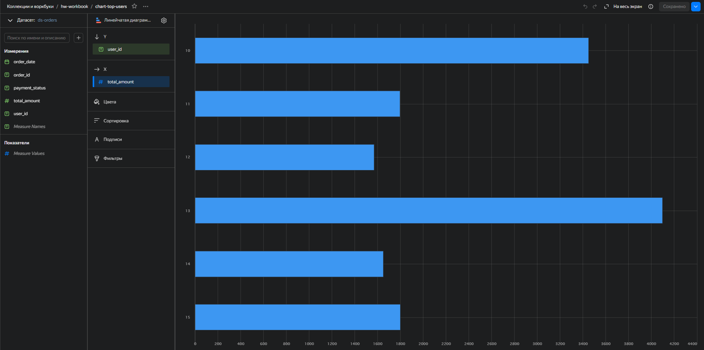
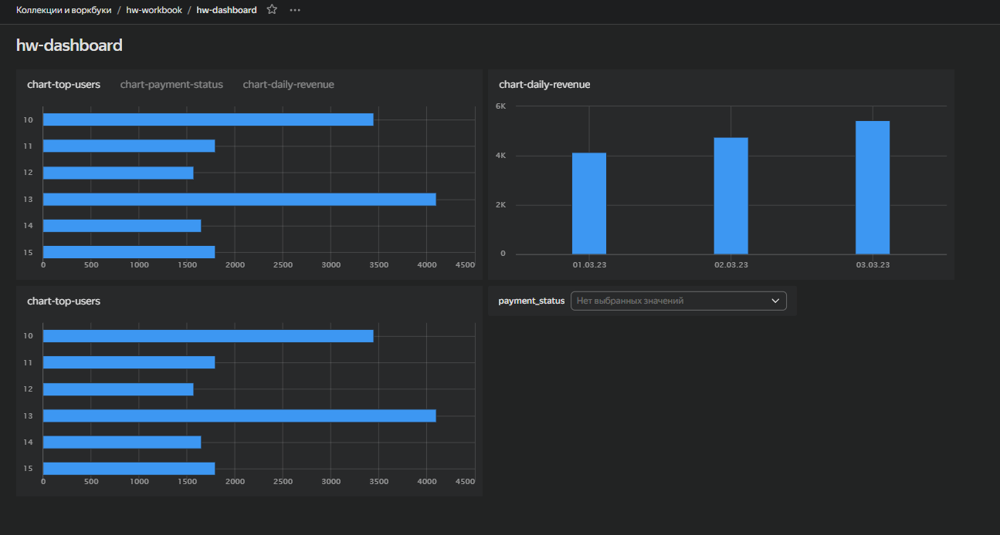

# Yandex Cloud — Обработка и анализ данных

**Дисциплина:** Семинар наставника  
**Тема:** Обработка и анализ данных в Yandex Cloud: от загрузки до визуализации  
**Преподаватель:** Владислав Шевченко  

---

## Стек технологий


---

## Структура репозитория

```
SN_HW1/
├── task1_dataproc/
│   ├── 01_create_tables.sql      # DDL для Hive/Spark: transactions_v2, logs_v2
│   ├── 02_aggregations.sql       # Агрегирующие SQL-запросы (Spark SQL)
│   └── task1_notebook.json       # Zeppelin-ноутбук (PySpark DataFrame API)
├── task2_clickhouse/
│   └── clickhouse_queries.sql    # DDL + 5 агрегаций для ClickHouse
├── task4_airflow/
│   └── hive_to_clickhouse_dag.py # Airflow DAG: репликация Hive → ClickHouse
├── screenshots/                  # Скриншоты результатов
└── README.md
```

---

## Задание 1 — Yandex Data Proc (Spark SQL)

### Описание
Поднят кластер Yandex Data Proc (Image 2.1, Spark 3.3.2 + Zeppelin). Данные загружены из Yandex Object Storage в два датафрейма: `transactions_v2` (20 строк) и `logs_v2` (16 строк). Выполнено 5 агрегаций через PySpark DataFrame API, результаты сохранены в HDFS по пути `/tmp/sandbox_zeppelin/task1_aggregations/`.

### Таблицы
| Таблица | Строк | Поля |
|---|---|---|
| `transactions_v2` | 20 | transaction_id, user_id, amount, currency, transaction_date, is_fraud |
| `logs_v2` | 16 | log_id, transaction_id, event_time, category, message |

### Выполненные агрегации
1. Суммарный объём транзакций по валютам (USD/EUR/RUB)
2. Статистика по мошенническим vs нормальным транзакциям
3. Ежедневная динамика транзакций
4. Анализ по месяцу и дню недели
5. JOIN с logs_v2: количество логов на транзакцию, топ категорий

---

## Задание 2 — ClickHouse

### Описание
Поднят кластер Managed Service for ClickHouse (v25.8 LTS). Созданы таблицы `orders` (16 строк) и `order_items` (16 строк) с движком MergeTree. Данные загружены через INSERT. Выполнено 5 аналитических запросов.

### Агрегация 1 — Статистика по статусам оплаты



**Результат:** paid — 10 заказов на сумму 11198.99, pending — 4 заказа на 3049.5, cancelled — 2 заказа на 120.

---

### Агрегация 2 — JOIN orders × order_items



**Результат:** paid-заказы: 7 позиций, 23 единицы товара, выручка 5699. pending: 4 позиции, 7 единиц, 2549.5.

---

### Агрегация 3 — Ежедневная статистика заказов



**Результат:** 3 дня данных — 2023-03-01 (5 заказов, 4149.5), 2023-03-02 (6 заказов, 4769), 2023-03-03 (5 заказов, 5449.99).

---

### Агрегация 4 — Топ-10 пользователей по сумме заказов



**Результат:** Лидер — user_id 13 (2 заказа, сумма 4100), второй — user_id 10 (5 заказов, сумма 3450).

---

### Агрегация 5 — Топ продуктов по выручке (paid)



**Результат:** Топ-1 GamingConsole (3 шт., выручка 1950), топ-2 Monitor и Smartphone (по 1200).

---

## Задание 3 — Визуализация в DataLens

### Описание
Создано подключение к ClickHouse кластеру через DataLens. Построен датасет `ds-orders` на основе таблицы `orders`. Созданы 3 чарта и собран дашборд с фильтром по `payment_status`.

### Чарт 1 — Выручка по датам (столбчатая диаграмма)



---

### Чарт 2 — Распределение по статусам (круговая диаграмма)



---

### Чарт 3 — Топ пользователей (горизонтальная диаграмма)



---

### Дашборд hw-dashboard



Дашборд включает все 3 чарта и селектор фильтрации по `payment_status`.

---

## Задание 4* — Airflow DAG (репликация Hive → ClickHouse)

### Описание
Реализован DAG `hive_to_clickhouse_replication` для ежедневной (03:00 UTC) репликации агрегированных данных из Spark/Hive в ClickHouse.

### Шаги DAG
```
write_spark_script → spark_export_hive_agg → clickhouse_load
```

1. `write_spark_script` — записывает PySpark-скрипт на Driver-узел
2. `spark_export_hive_agg` — читает `transactions_v2`, агрегирует по датам, сохраняет CSV в HDFS
3. `clickhouse_load` — загружает CSV из HDFS в таблицу `tx_daily_agg` в ClickHouse

### Схема таблицы-приёмника
```sql
CREATE TABLE tx_daily_agg (
    transaction_date Date,
    tx_count         UInt64,
    daily_total      Float64,
    daily_avg        Float64,
    fraud_count      UInt64
) ENGINE = ReplacingMergeTree()
ORDER BY transaction_date;
```

---

## Инфраструктура Yandex Cloud

| Сервис | Имя | Конфигурация |
|---|---|---|
| Data Proc | dataproc234 | Image 2.1, Spark+Zeppelin, s3-c2-m8 |
| ClickHouse | hw-clickhouse | v25.8 LTS, s4a-c2-m8 |
| Object Storage | hw-hse1 | Стандартный, приватный |
| DataLens | hw-workbook | Подключение к ClickHouse |
